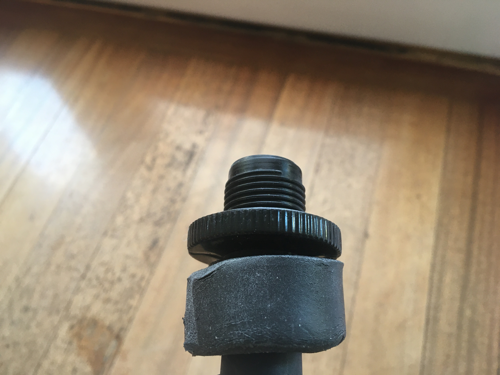
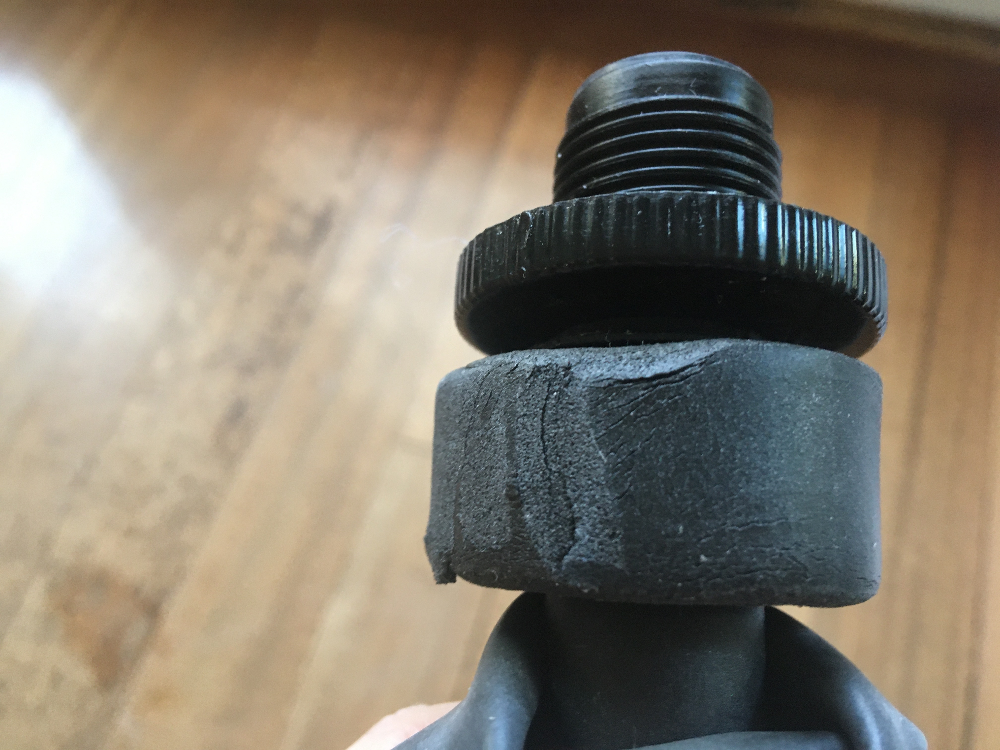
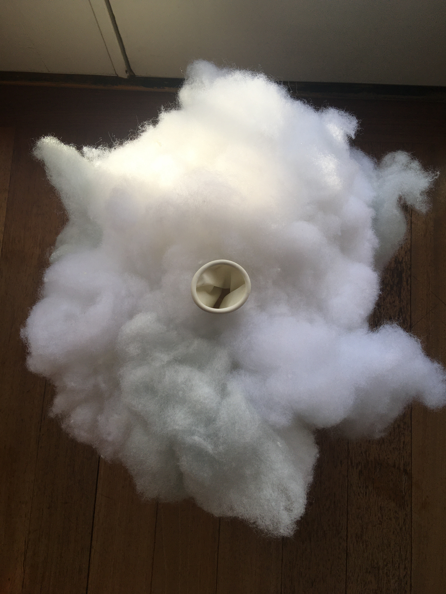

# The Cloud
Repo for the Cloud app with Python 3.9

- [The Cloud](#the-cloud)
  - [For Makers](#for-makers)
    - [Materials](#materials)
    - [Build](#build)
      - [Pump](#pump)
      - [Clouds](#clouds)
  - [For Developers](#for-developers)
    - [Poetry](#poetry)
    - [Raspberry Pi](#raspberry-pi)
      - [Networking](#networking)
      - [ngrok](#ngrok)
      - [Troubleshooting](#troubleshooting)

## For Makers

This project was created with the intention of making it possible for others to create and run their own clouds. The code is here and open for those who'd like to fork and modify.

### Materials

To build the clouds and pumps themselves, you'll need some materials. You do not need to get these specific items for the most part, just something similar. You can purchase from any proprietor:

* A [smart WiFi outlet from Kasa](https://www.amazon.com/gp/product/B091FXH2FR/ref=ppx_yo_dt_b_asin_title_o05_s00?ie=UTF8&th=1). Unlike the other items, this must be a Kasa brand smart outlet, because we're using the [Python Kasa API](https://github.com/python-kasa/python-kasa).
* An [air pump](https://www.coleman.com/sleeping-bags-beds/airbeds-pumps/quickpump-120v-pump-with-extension-hose/SAP_2000021141.html)
* A [check valve](https://www.amazon.com/gp/product/B092THK2F9/ref=ppx_od_dt_b_asin_title_s00?ie=UTF8&th=1)
* A way [to attach the check valve](https://www.amazon.com/gp/product/B09BHWMSTD/ref=ppx_od_dt_b_asin_title_s00?ie=UTF8&th=1) to the pump.
* [Foam tape](https://www.lowes.com/pd/Frost-King-10-ft-x-3-4-in-Black-Rubber-Foam-Window-Weatherstrip/3047980) to make a tighter seal between the balloon and pump.
* Some [giant balloons](https://www.amazon.com/gp/product/B08233XMST/ref=ppx_yo_dt_b_asin_title_o02_s00?ie=UTF8&th=1)
* [Spray glue](https://www.michaels.com/product/scotch-super-77-multipurpose-spray-adhesive-10218960)
* [Fiber stuffing](https://www.michaels.com/product/supreme-fiber-fill-by-loops-threads-10436592)

### Build

#### Pump
To create the pump, attach the open side of the check valve to the end of your air pump hose. It may be easier to do if you remove the check valve cap completely by cutting it off. You can screw the valve into the hose and then use the foam tape to create a base where they meet.



You may want to cut the foam tape so it tapers to an even surface.



You should now have a pump that allows air to be blown through the hose but does not allow it to travel back.

#### Clouds

To make the clouds, put the opening of a balloon around the mouth of your pump, making sure it reaches past the foam tape. You can secure it with some string in a [clove hitch](https://www.netknots.com/rope_knots/clove-hitch).


Blow the balloon up until it reaches about a foot and a half diameter. Glue fiber to the balloon with spray glue. You should do this outside or in a well-ventilated area, using appropriate safety equipment. Let it dry blown up, then you can take the balloon off the pump and let it deflate.



You'll want to set up the app with the balloon deflated.

## For Developers

### Poetry
You can run locally with Poetry by first [installing the dependencies specified](https://python-poetry.org/docs/basic-usage/#installing-dependencies) with `poetry install` and then using the [poetry run](https://python-poetry.org/docs/basic-usage/#using-poetry-run) command:

```
cd cloud
poetry run python app.py
```

Keep Poetry up to date by running `poetry install --sync` when you add new dependencies. If you have issues running `poetry install`, try `poetry install -q`.

You can also run with an application server, instead of running Flask directly:

```
cd cloud
poetry run gunicorn 'app:app'
```

If you make changes to `poetry.lock`, run `poetry export -o cloud/requirements.txt` to update requirements for use in a non-Poetry virtual environment.

To use a non-Poetry virtualenv:

```
cd top_level_dir
python3 -m venv env
. env/bin/activate
pip install -r cloud/requirements.txt
cd cloud
gunicorn app:app
```

Then `deactivate` when you are done using the environment.

To update Poetry, run `poetry self update` or `poetry self update -q`. If those don't work, you can always remove then reinstall Poetry.

```
rm -rf ~/.local/share/pypoetry/
rm ~/.local/bin/poetry
curl -sSL https://install.python-poetry.org | python3 -
```

### Raspberry Pi

To run open to the internet, you can use a [Raspberry Pi](https://www.raspberrypi.org). You'll have to install Poetry to install dependencies as indicated above, or set up a virtual environment and run `pip install -r cloud/requirements.txt`. Copy the code from this repository (with or without changes) to your Pi.

#### Networking

The Pi will need two network interfaces, one wireless, for connection to the smart outlet, and the other either wireless or wired, for connection to the internet. It may be simpler to use an Ethernet connection for the latter. Exposing the service running on the Pi to the outside world can be accomplished various ways. Where you control the router at the edge of your network, you could use port forwarding to direct incoming traffic to the Pi. In its current deployment, without that control, we're using [ngrok](https://ngrok.com/). A [Cloudflare tunnel](#cloudflare-tunnel) is another possibility.

In many situations, you will not have access to an ethernet port, and will need two wireless connections. Further, in some cases you will not be in a place with a usable wifi access point, so you may need to tether the Pi to a phone acting as hotspot. Because the Pi only has one on-board wireless network interface, get a USB wireless interface, something like [this](https://www.adafruit.com/product/1012). (It is possible to tether via Bluetooth, which would obviate the need for the external wifi interface, but we haven't experimented with this yet.) Here's a way to set up both interfaces, using the tethering example; this is basically similar to using some other wireless access point.

The two wireless network interfaces are called wlan0 and wlan1 (it shouldn't matter which is which); we'll use the Pi's built-in configuration system, `raspi-config`, to configure the former, and we'll configure the latter by hand to connect to the Kasa smartplug. (The actual mechanism for configuration is the same, files in `/etc/wpa_supplicant`; it's just convenient to use `raspi-config` for the one that may change more frequently.)

First, make the file `/etc/wpa_supplicant/wpa_supplicant-wlan1.conf`; you might need to change the SSID for your smartplug:

```
ctrl_interface=DIR=/var/run/wpa_supplicant GROUP=netdev
update_config=1
country=US

network={
    ssid="TP-LINK_Smart Plug_92E9"
    key_mgmt=NONE
}
```

Then, start a hotspot on your phone; run `sudo raspi-config`, select "System options" in the first menu, then "Wireless LAN" in the second; enter the hotspot's SSID, then the hotspot's password. This produces `/etc/wpa_supplicant/wpa_supplicant.conf`. Wait a few seconds or a minute, then confirm you're online. Note that re-running this as you move to new networks is additive; you'll end up with multiple `network` sections in the config file, so you may want to clean it out periodically.

#### ngrok

Exposing the application via ngrok requires [the installation of ngrok](https://dashboard.ngrok.com/get-started/setup/raspberrypi). There are a few different approaches, but this `apt` method works:

```
curl -s https://ngrok-agent.s3.amazonaws.com/ngrok.asc | sudo tee /etc/apt/trusted.gpg.d/ngrok.asc >/dev/null && echo "deb https://ngrok-agent.s3.amazonaws.com bullseye main" | sudo tee /etc/apt/sources.list.d/ngrok.list && sudo apt update && sudo apt install ngrok
```

You could then run `ngrok config add-authtoken <your-authtoken>`, start the application with `poetry run python app.py`, and run `ngrok http http://localhost:5000`, but for regular use you'll want to [create a static domain](https://dashboard.ngrok.com/cloud-edge/domains), set up a config file, something like

```
version: 2
authtoken: <your-authtoken>
tunnels:
  the-cloud:
    proto: http
    addr: 5000
    domain: <your-domain>
```

then install and start the service with

```
sudo ngrok service install --config ~/.config/ngrok/ngrok.yml
sudo ngrok service start
```

#### Troubleshooting

We've observed two error conditions. One, when we were experimenting with a Cloudflare tunnel instead of ngrok, was that occasionally the tunnel stopped working. This could be fixed by restarting `cloudflared`; a possible mitigation would be to restart `cloudflared` on a schedule. We have not yet spent enough time running ngrok to know if there's an equivalent issue, but `sudo ngrok service restart` should do the trick.

The other problem is when the Kasa smartplug becomes unresponsive; in this case, the Pi appears still to be on both networks, and sends on/off messages to the smartplug, but it doesn't act on them. Switching the smartplug briefly to always-on, then back, appears to fix this, though the plug may then act on all the messages sent in the meantime. It's possible some reconnection in software could help.

[Back to top](#the-cloud)
